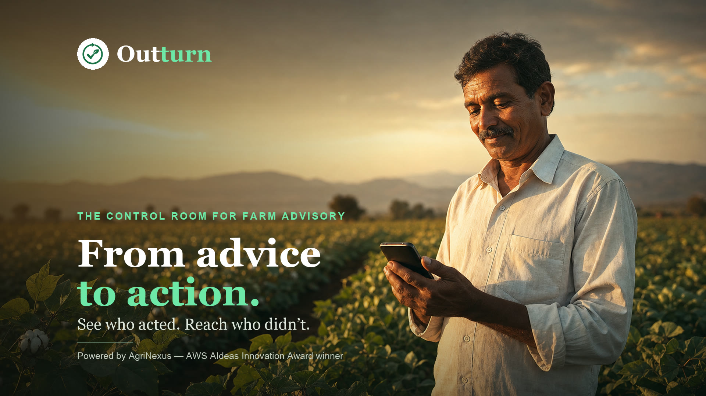
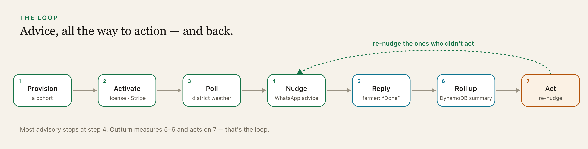
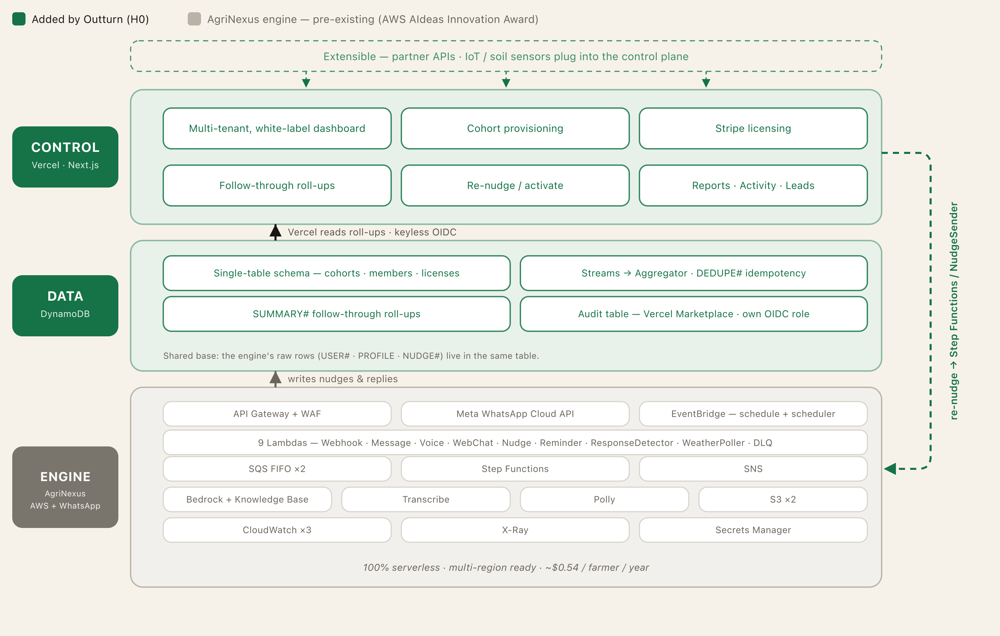
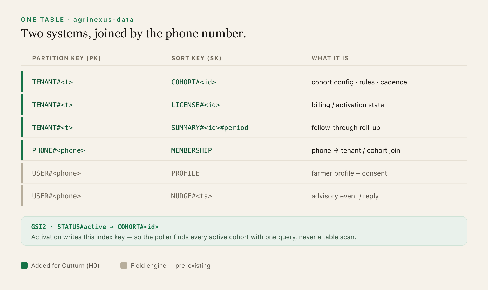

# Outturn — Advice, followed through

**The B2B control plane for agricultural advisory programs.** Partners provision district cohorts, license them with Stripe, run weather-rule advisory cycles on Amazon DynamoDB + Vercel, see exactly who acted on each nudge, and gently follow up with those who didn't. Built on **AgriNexus**, an AWS-award-winning WhatsApp advisory engine.

---

**Why it matters.** A smallholder farmer with two acres of cotton makes or breaks the season on a few decisions — spray *before* the wind picks up, irrigate in the dry window. The advice exists; getting farmers to act on it, at the moment it matters, mostly doesn't. One extension officer covers thousands of farmers, SMS blasts and apps go out into the void, and **nobody can tell you whether a single farmer actually did the thing.**

**What I built.** Outturn is the dashboard a partner — an NGO, an agri-input company, a [Krishi Vigyan Kendra](https://en.wikipedia.org/wiki/Krishi_Vigyan_Kendra) (a government farm-science centre) — signs into. They create a cohort (a district + crop), set the safe-to-spray thresholds, activate it through Stripe, enroll farmers by phone, run an advisory cycle, and watch follow-through move in real time — *28 of 42 acted, 67%* — rolled up from real replies, not delivery receipts. Then they re-nudge the ones who went quiet.

**The differentiator.** The closed loop. Most advisory tools stop at *sending*. Outturn measures the **reply**, rolls it up, and acts on whoever didn't — so a partner can *prove* follow-through well enough to fund the next ten districts. Accountability here isn't paperwork; it's what lets good advice get funded.

**Deterministic on purpose.** "Is today safe to advise spraying?" is a rule a partner can read for themselves — wind, humidity, temperature, a dry window. "Did the farmer act?" is a literal `DONE` reply, not an inference. No model guessing; a field officer can trace the whole chain end to end.

[](https://nextjs.org/)
[](https://vercel.com/)
[](https://www.typescriptlang.org/)
[](https://aws.amazon.com/dynamodb/)
[](https://docs.aws.amazon.com/amazondynamodb/latest/developerguide/Streams.html)
[](https://vercel.com/docs/security/secure-backend-access/oidc)
[](https://stripe.com/)
[](LICENSE)

---

> ### 🌾 H0 — Hack the Zero Stack · Track 2 (Monetizable B2B)
>
> **For judges, reviewers, and fellow builders — three fastest paths in:**
>
> | Path | Link | Time |
> | --- | --- | --- |
> | 🎥 **Watch the demo** | [youtu.be/vNiYzId0RBU](https://youtu.be/vNiYzId0RBU) | 3 min |
> | 🖥️ **Open the live app** | [outturn.vercel.app/login](https://outturn.vercel.app/login) — one-click demo persona, no wall | 1 min |
> | 🧭 **Guided demo + stack** | [outturn.vercel.app/judges](https://outturn.vercel.app/judges) | 3 min |
> | 🔍 **Full-res infrastructure proof** | [outturn.vercel.app/proof](https://outturn.vercel.app/proof) | 2 min |
>
> **TL;DR:** Outturn is the missing control plane over a proven WhatsApp advisory engine. Partners provision and license cohorts; a GSI-driven poller runs weather-rule advisory cycles; DynamoDB Streams roll farmer replies into live follow-through numbers. 100% serverless, keyless to AWS via Vercel OIDC, and deterministic — the loop *is* the product.

---

## Contents

- [H0 Quickstart](#-h0--hack-the-zero-stack--track-2-monetizable-b2b)
- [New vs existing (submission boundary)](#new-vs-existing-submission-boundary)
- [The closed loop](#the-closed-loop)
- [What ships](#what-ships)
- [Architecture](#architecture)
- [Data model](#data-model)
- [Tech stack](#tech-stack)
- [Secrets strategy](#secrets-strategy)
- [Quick start (run it locally)](#quick-start-run-it-locally)
- [Judge demo access](#judge-demo-access)
- [Project structure](#project-structure)
- [Honest tradeoffs](#honest-tradeoffs)
- [Roadmap](#roadmap)
- [About AgriNexus AI](#about-agrinexus-ai)
- [Documentation](#documentation)
- [License](#license)
- [Security](#security)
- [Contact](#contact)

> **Naming note:** "Outturn" is the product/display name for the H0 submission. Internal identifiers (repo, DynamoDB table `agrinexus-data`, API routes, env vars, entity keys) intentionally keep the `agrinexus` prefix.

---

## New vs existing (submission boundary)

| Component | Status |
|-----------|--------|
| **AgriNexus delivery engine** (WhatsApp advisory, weather poll, nudge loop, Step Functions) | Pre-existing — AWS AIdeas Innovation Award winner |
| **Outturn** (this repo: partner provisioning, tenant isolation, dashboard, Stripe licensing, Streams aggregation, audit log) | **New — built for H0** |

The platform is the missing control plane: it lets NGOs, agri-input firms, and government extension programs ([KVK](https://en.wikipedia.org/wiki/Krishi_Vigyan_Kendra)s) provision and monitor advisory cohorts without engineering support.

## The closed loop



The whole product runs on one sentence: **provision → activate → poll → nudge → reply → roll up → act.** Most advisory stops at "nudge." Outturn measures the reply, rolls it up, and acts on whoever didn't. The dashboard is the steering wheel for that loop.

## What ships

- **Multi-tenant DynamoDB model** (`TENANT#`, `COHORT#`, `LICENSE#`, `SUMMARY#`, `MEMBERSHIP`) — tenant isolation is physical (rows live under `TENANT#<tenantId>`), not a `WHERE` clause you have to remember.
- **Self-serve cohort provisioning wizard** — district, crops, languages, weather-rule thresholds, nudge cadence.
- **Activation as a data contract** — activating a cohort writes a `LICENSE#` row and stamps a `GSI2PK = STATUS#active` key the poller queries; drafts are invisible to the loop.
- **Control-plane-drives-delivery-plane coupling** — a poller finds active cohorts, checks each district's weather against the rules, and fires the engine's existing Step Functions workflow.
- **Materialized outcome summaries via DynamoDB Streams** — an `OutcomesAggregator` Lambda keeps one `SUMMARY#` row per cohort per month; idempotent via a `DEDUPE#<eventID>` claim so at-least-once Streams can't double-count.
- **Tiered Stripe Checkout** (Starter / Growth / Enterprise) + one-click demo activation so judges aren't stuck behind a paywall.
- **Consent-safe enrollment** — enrolling a farmer writes `MEMBERSHIP` and seeds a `PROFILE` with `consent=pending` only if none exists; the sender refuses to message anyone not `granted`.
- **Audited, admin-only re-nudge** — flag cohorts going quiet and re-nudge non-responders, gated against double-sending.

## Architecture



*Green is the H0 build; gray is the proven engine. They meet at `agrinexus-data` in my own AWS account — with the audit trail on a second, Vercel Marketplace–managed table.*

- **Control plane (new):** Next.js front end + every API route on **Vercel**, over **Amazon DynamoDB**.
- **Delivery engine (pre-existing):** Lambda, Step Functions, EventBridge, API Gateway, WhatsApp via Meta's Cloud API.
- **The join key is the phone number** — `MEMBERSHIP` rows attribute a farmer to a tenant/cohort, so the two systems read as one product.
- **Keyless to AWS.** Production reaches DynamoDB through **Vercel OIDC federation**: Vercel mints a per-deployment token, the app assumes an AWS role via **STS**, the SDK gets short-lived credentials. `AWS_SECRET_ACCESS_KEY` never appears in the production path.
- **Two federations, two accounts** (by design): one into my **own** account where live `agrinexus-data` lives; one into the **Vercel Marketplace** integration's *managed* account where the partner **audit log** is its own DynamoDB table with its own OIDC role — no shared blast radius.

## Data model



One table (`agrinexus-data`), single-table layout, plain on purpose:

```text
TENANT#<tenantId> / COHORT#<cohortId>             partner-owned cohort config
TENANT#<tenantId> / LICENSE#<cohortId>            billing state
TENANT#<tenantId> / SUMMARY#<cohortId>#YYYY-MM    materialized outcomes (Streams)
PHONE#<phone>     / MEMBERSHIP                     phone → tenant/cohort join
USER#<phone>      / PROFILE                        field-engine farmer profile
USER#<phone>      / NUDGE#<ts>#<activity>          field-engine advisory events
```

Active-cohort discovery rides a secondary index — `GSI2PK = STATUS#active`, `GSI2SK = COHORT#<cohortId>` — so the poller finds work in one query, no scan.

## Tech stack

| Service | Role |
|---------|------|
| **Vercel** (Next.js App Router) | Front end + all control-plane API routes, serverless |
| **Amazon DynamoDB** | Primary backend — multi-tenant single table, GSIs, Streams |
| **DynamoDB Streams + Lambda** | `OutcomesAggregator` materializes cohort summaries, idempotently |
| **Vercel OIDC + AWS STS** | Keyless federation into AWS (two accounts) |
| **Step Functions / EventBridge / API Gateway** | Pre-existing nudge workflow the control plane drives |
| **Stripe** | Tiered licensing (Checkout) + demo activation |
| **AWS Secrets Manager** | Source of truth for application secrets |
| **OpenWeatherMap** | Weather inputs for the deterministic advisory rules |

## Secrets strategy

AWS Secrets Manager is the source of truth for application secrets. Only the non-sensitive config (region, table name) lives in Vercel env vars; production uses OIDC, so there are **no long-lived AWS keys** in the production path.

| Secret / config | Location | Notes |
|-----------------|----------|-------|
| AWS access (production) | **Vercel OIDC → STS** | Keyless; short-lived credentials per deployment |
| `AWS_REGION`, `DYNAMODB_TABLE_NAME`, `AWS_ACCOUNT_ID`, `NEXT_PUBLIC_APP_URL` | Vercel env vars | Non-sensitive config |
| Stripe key + per-tier price IDs | Secrets Manager `Stripe-Secret` | `{ secretKey, priceIds: { starter, growth, enterprise } }` |
| Weather API key | Secrets Manager `agrinexus/weather/api-key` | Plain-string secret |

Runtime access (`lib/secrets.ts`, `lib/stripe-secrets.ts`) tries Secrets Manager first and only falls back to env vars for local dev. Values are cached in-memory for 5 minutes. The judge demo path uses "Demo activate" and never requires Stripe to be configured.

## Quick start (run it locally)

**Prerequisites:** Node.js 18+, an AWS account with DynamoDB access. Optional: Stripe test keys, OpenWeatherMap API key.

```bash
cd agrinexus-platform
npm install
cp .env.example .env.local      # edit with AWS credentials for local dev
npm run dev
```

Open [http://localhost:3000](http://localhost:3000) and use **Demo Login** on `/login`.

```bash
npm run seed                    # 3 partner tenants, cohorts, farmers, summaries
```

Healthcheck: [http://localhost:3000/api/healthcheck](http://localhost:3000/api/healthcheck) verifies DynamoDB connectivity.

**Deploy to Vercel:** import the repo at [vercel.com/new](https://vercel.com/new), set env vars from `.env.example`, wire OIDC federation to your AWS account, and redeploy.

## Judge demo access

1. Open [outturn.vercel.app/login](https://outturn.vercel.app/login) — no permission wall.
2. Click a **demo persona** (e.g. *GreenHarvest NGO*).
3. **Run an advisory cycle** from the dashboard and watch sent/skipped results.
4. **Create a cohort** via the wizard → activate via **demo activation** (free) or Stripe test checkout.
5. Open a **cohort detail** page for follow-through %, member stats, and the **re-nudge** action.
6. Open **Activity** to see audited control-plane events (Vercel Marketplace DynamoDB table).
7. Use the **tenant switcher** to confirm isolation between partners.
8. Optional: message the live field engine on WhatsApp at [wa.me/4915120105731](https://wa.me/4915120105731).

## Project structure

```text
agrinexus-platform/
├── app/                    # Next.js App Router (dashboard, API routes, components)
├── components/             # Shared UI components
├── lib/                    # DynamoDB entities, Stripe, auth, secrets, Lambdas
├── middleware.ts           # Auth / tenant routing
├── scripts/                # Seed and ops scripts
├── infra/                  # IAM policies (least-privilege)
├── architecture/           # Architecture sources
└── public/                 # Logos, marks, proof gallery + architecture assets
```

> Internal design docs and raw demo-video sources live under a local-only `docs/` folder that is intentionally **not** published (see `.gitignore`).

## Honest tradeoffs

Every call was a fork with a real downside. Naming the trade-off is the point:

| Decision | Why | What it costs |
|---|---|---|
| **Single-table design** | One round-trip per screen, no joins, cheap reads | Opaque to a newcomer; access patterns fixed up front |
| **Activation = a GSI key** (`STATUS#active`), not a status flag | Poller finds active cohorts in one query, no scan | You model the lifecycle as data, not a code branch |
| **Materialized roll-ups via Streams**, not on-read scans | Fast dashboard reads — one `SUMMARY#` row | A few seconds of eventual consistency |
| **Idempotent aggregation** (`DEDUPE#` claim) | Streams are at-least-once; atomic ≠ correct | An extra conditional write per event |
| **Two keyless OIDC federations**, two accounts | Live data in my account; audit log on managed infra — no shared blast radius | Two trust relationships to wire and reason about |
| **Consent as a separate state**, gated at the sender | Enrolling a farmer can never accidentally message them | Two states to track — "enrolled" vs "may message" |
| **Demo poller isolated** from the prod schedule | A judge runs the *real* loop, safely | A parallel entry point to maintain |

## Roadmap

Three directions, all the same accountable loop — not a feature laundry list:

- **More of what moves a farmer's income.** The same nudge-and-follow-through loop fits input-credit and microfinance reminders, market-price alerts, and irrigation / sowing / pest-scouting programs — each a configurable rule set.
- **Sensor-driven nudges.** Partner with soil-moisture and irrigation IoT providers, roll readings into the engine, and turn them into the same accountable nudges — soil-based, not just weather-based.
- **Reach, made self-serve.** Per-partner WhatsApp numbers via Meta Embedded Signup (true white-label), plus QR self-onboarding so a partner can stand up a new district and let farmers join by scanning a poster.

The pattern generalizes, but the engine is agriculture-specific today — so the honest next step is careful productization, not pretending every vertical is already a toggle.

## About AgriNexus AI

The farmer-facing engine — [**AgriNexus AI**](https://github.com/prasadt1/agrinexus-ai) — won the **AWS AIdeas Innovation Award** for a production WhatsApp advisory engine modeled at ~$0.54/farmer/year. Outturn is the B2B layer partners need to provision, license, and monitor it. The engine predates the H0 window; the control plane, DynamoDB integration, Streams rollups, audit table, billing, and control-plane-driven advisory loop in this repo are the H0 build.

## Documentation

The best documentation is the live app itself:

| Resource | Where |
|---|---|
| 🧭 **Guided demo + stack walkthrough** | [outturn.vercel.app/judges](https://outturn.vercel.app/judges) |
| 🔍 **Infrastructure proof gallery** (architecture, DynamoDB, keyless OIDC) | [outturn.vercel.app/proof](https://outturn.vercel.app/proof) |
| 🎥 **Demo video** | [youtu.be/vNiYzId0RBU](https://youtu.be/vNiYzId0RBU) |
| 🏗️ **Architecture diagrams** (in repo) | [`public/devpost/`](public/devpost) · [`public/architecture/`](public/architecture) |
| ✅ **Validation notes** | [`VALIDATION.md`](VALIDATION.md) |
| 📝 **Changelog** | [`CHANGELOG.md`](CHANGELOG.md) |

> Detailed internal design docs (product spec, data-model deep-dive, execution plans) are kept private. For architecture or partnership questions, email **prasad@prasadtilloo.com**.

## License

**Source-Available** — see [LICENSE](LICENSE). The code is public for portfolio, evaluation, and competition review. Viewing, local non-commercial evaluation, and forking to submit issues/PRs are permitted. Commercial use, redistribution, derivative products, and white-labelling require written permission. For licensing or partnership enquiries: **prasad@prasadtilloo.com**.

## Security

Found a security or privacy issue? Please **do not** open a public issue. See [SECURITY.md](SECURITY.md) and email **prasad@prasadtilloo.com**. Never put real phone numbers, tokens, or secrets in issues or PRs.

## Contact

Prasad Tilloo · [prasadtilloo.com](https://prasadtilloo.com) · prasad@prasadtilloo.com
