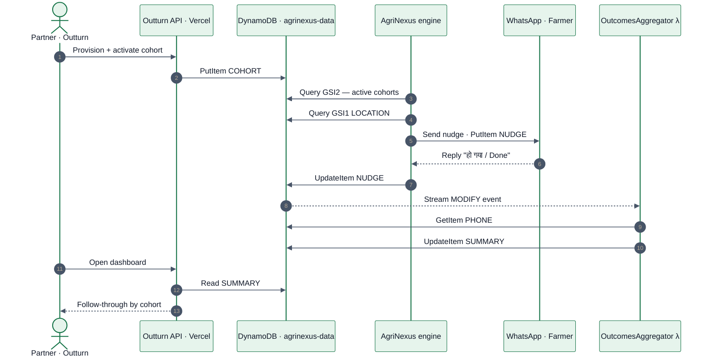
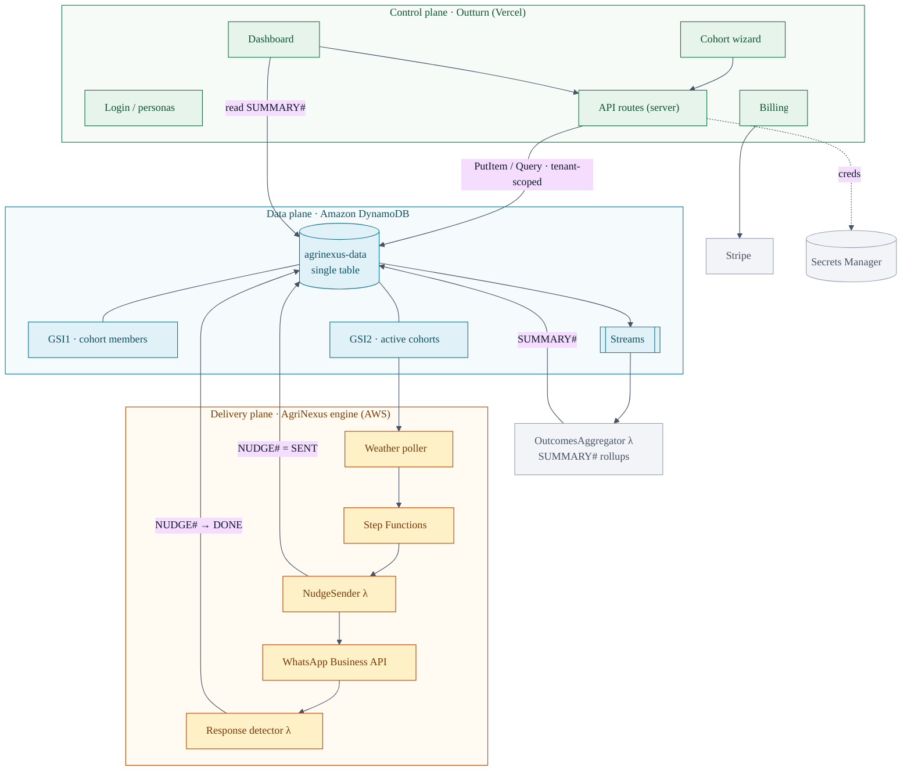

# Diagrams

Brand palette: primary `#157347`, deep `#0F5132`, tint `#E6F4EC`, teal `#0E7490`, amber `#B54708`,
border `#E4E7EC`, text `#101828` / `#475467`.

## 1 · Closed-loop sequence — provision → nudge → reply → attribute → roll up

## 2 · Three-plane system — Outturn / DynamoDB / AgriNexus

> Note on accuracy: outbound recipients are selected by district (`GSI1 LOCATION#` on the engine's
> farmer profiles); inbound outcomes are attributed by phone (`PHONE#/MEMBERSHIP`). The loop closes
> for a farmer who is both enrolled by a partner and opted-in over WhatsApp.
