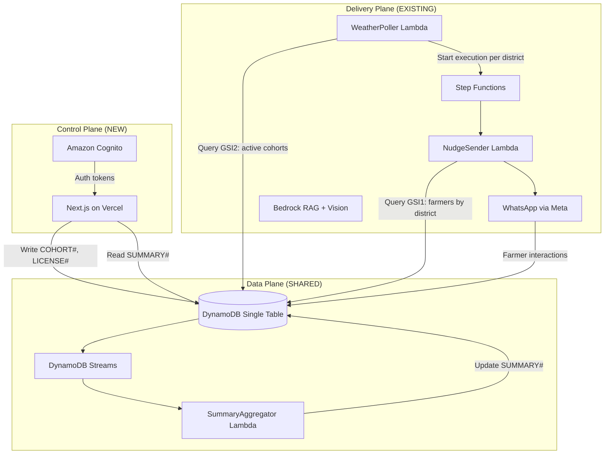
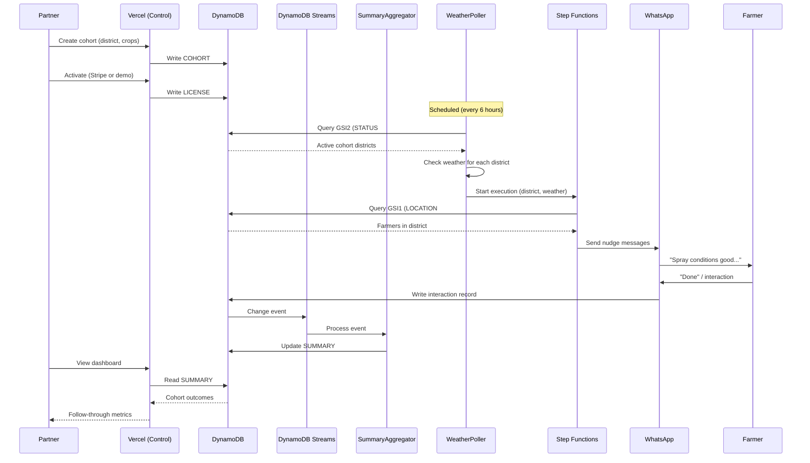
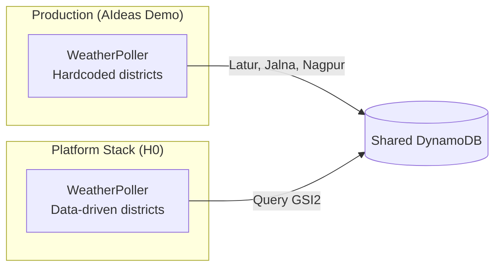
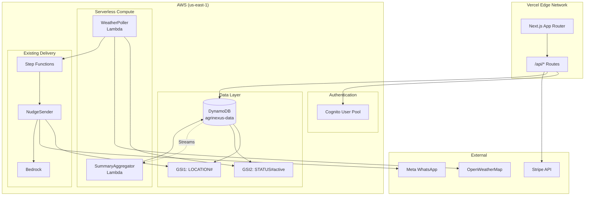
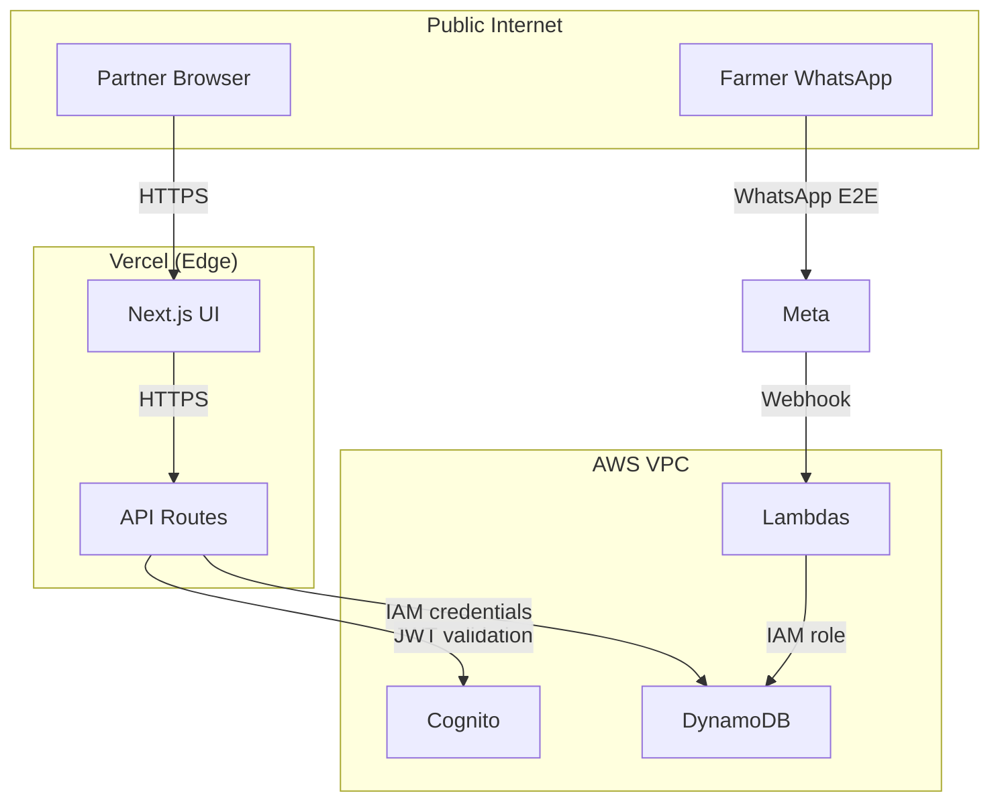

# 02 — Architecture

> **Design principle:** Three planes, one DynamoDB table, deliberate AWS service selection.

---

## Three-Plane Architecture



| Plane | Responsibility | Status |
|-------|----------------|--------|
| **Control** | Partner UI, provisioning, analytics, billing | NEW |
| **Data** | DynamoDB single table, Streams aggregation | NEW modeling on existing table |
| **Delivery** | WhatsApp advisory, nudge engine, RAG | EXISTING (one bounded change) |

---

## System Flow



---

## AWS Services (Deliberate Selection)

Each service is justified by a specific job. The rubric rewards "deliberate," not "many."

| Service | Job | Justification |
|---------|-----|---------------|
| **DynamoDB** | Primary backend, multi-tenant single table | Required. Central to the architecture. On-demand billing scales with usage. |
| **DynamoDB Streams** | Change data capture for aggregation | Enables real-time summary updates without polling. Tier 2 feature. |
| **Lambda** | SummaryAggregator, WeatherPoller modifications | Serverless compute for event processing. Pay-per-invocation. |
| **Cognito** | Partner authentication, tenant identity | AWS-native auth anchors the multi-tenant story. Provides JWT with tenant claims. |
| **Step Functions** | Nudge workflow orchestration | EXISTING. Already handles reminder scheduling. |
| **Bedrock** | RAG + Vision for advisory | EXISTING. Powers the knowledge retrieval and crop diagnosis. |
| **SES** | Partner notifications (optional) | Light touch. "Your cohort is live" emails. Skip if time-constrained. |

### Services NOT Used (and Why)

| Service | Why Not |
|---------|---------|
| RDS/Aurora | DynamoDB handles all access patterns; no relational joins needed |
| OpenSearch | GSIs provide sufficient query flexibility; no full-text search required |
| API Gateway | Vercel API routes handle HTTP; no need for separate gateway |
| EventBridge | Step Functions already handles scheduling; avoid duplication |

---

## The Data-Driven WeatherPoller Change

> **This is the one bounded modification to the existing delivery engine.**

### Current State (from VALIDATION.md)

```python
# agrinexus-ai/src/weather/handler.py (lines 49-53)
DISTRICT_COORDS = {
    'Latur': {'lat': 18.4088, 'lon': 76.5604},
    'Jalna': {'lat': 19.8347, 'lon': 75.8816},
    'Nagpur': {'lat': 21.1458, 'lon': 79.0882},
}
```

**Problem:** A partner provisioning a cohort for "Pune" would never receive weather checks because Pune is not in the hardcoded dict.

### Target State

```python
def get_active_cohort_districts() -> List[dict]:
    """
    Query active cohorts from DynamoDB using GSI2.
    Returns list of {district, lat, lon} for weather polling.
    """
    response = table.query(
        IndexName='GSI2',
        KeyConditionExpression='GSI2PK = :status',
        ExpressionAttributeValues={':status': 'STATUS#active'}
    )
    return [
        {'district': item['district'], 'lat': item['lat'], 'lon': item['lon']}
        for item in response.get('Items', [])
    ]
```

### Why This Works

From VALIDATION.md findings:

| Aspect | Finding | Implication |
|--------|---------|-------------|
| Nudge flow | Already district-scoped (one Step Functions execution per location) | No changes needed to Step Functions or NudgeSender |
| Farmer profiles | Already have `location` field + `GSI1PK = LOCATION#{district}` | Cohort attribution works out of the box |
| Blast radius | 2 source files + template.yaml | Low risk, can isolate in separate stack |

### Deployment Strategy



- **Production stack** continues using hardcoded WeatherPoller
- **Platform stack** deploys modified WeatherPoller that reads from GSI2
- Both share the same DynamoDB table
- Feature flag (`COHORT_MODE=dynamic|static`) for safety

---

## Conflict Flags

> ⚠️ **Spec vs. Code Conflicts** (from VALIDATION.md)

### GSI Naming Convention

| Spec | Existing Code | Resolution |
|------|---------------|------------|
| `GSI1PK = DISTRICT#<district>` | `GSI1PK = LOCATION#<district>` | Use existing `LOCATION#` prefix; document the convention |

### GSI2 Purpose

| Spec | Existing Code | Resolution |
|------|---------------|------------|
| `GSI2PK = STATUS#active` for cohort queries | `GSI2PK = NUDGE` for nudge listings | Add new GSI or repurpose; see Data Model doc |

### District Coordinates

| Spec | Existing Code | Resolution |
|------|---------------|------------|
| Cohort entity stores `lat`, `lon` | `DISTRICT_COORDS` hardcoded in Python | Cohort provisioning must include coordinates; provide lookup or map UI |

---

## Component Diagram



---

## Latency Expectations

| Path | Expected Latency | Notes |
|------|------------------|-------|
| Vercel → DynamoDB | 20-50ms | Vercel edge to us-east-1 |
| Dashboard page load | <2s | SSR with materialized summaries |
| Cohort provisioning | <500ms | Single PutItem |
| Aggregator processing | <100ms | Streams + Lambda |
| WeatherPoller cycle | ~30s total | 4 districts × API calls |

---

## Security Boundaries



**Tenant isolation enforced at:**
1. Cognito JWT contains `tenantId` claim
2. API routes extract `tenantId` from JWT
3. All DynamoDB queries scoped to `PK = TENANT#<tenantId>`
