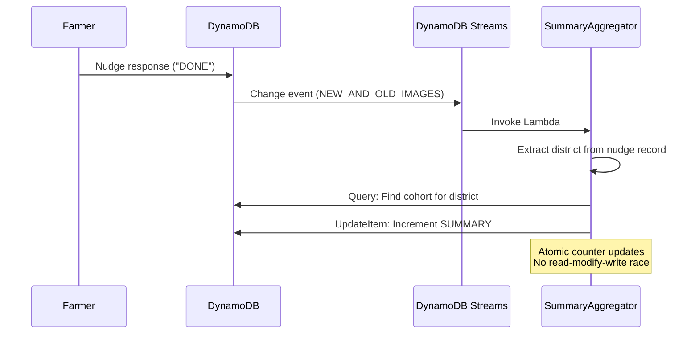

# 03 — Data Model

> **Design:** Multi-tenant single-table DynamoDB with GSIs and Streams aggregation.

---

## Table Configuration

```
Table Name: agrinexus-data
Billing Mode: On-Demand (PAY_PER_REQUEST)
Partition Key: PK (String)
Sort Key: SK (String)
Streams: Enabled (NEW_AND_OLD_IMAGES)
```

---

## Entity Definitions

### New Entities (Platform)

| Entity | PK | SK | Key Attributes |
|--------|----|----|----------------|
| **Tenant** | `TENANT#<tenantId>` | `META` | name, type, createdAt, plan |
| **Partner User** | `TENANT#<tenantId>` | `USER#<userId>` | cognitoSub, email, role |
| **Cohort** | `TENANT#<tenantId>` | `COHORT#<cohortId>` | district, lat, lon, crops[], languages[], nudgeRules, status |
| **License** | `TENANT#<tenantId>` | `LICENSE#<cohortId>` | stripeSubId, plan, status, periodEnd |
| **Outcome Summary** | `TENANT#<tenantId>` | `SUMMARY#<cohortId>#<period>` | adviceSent, nudgesSent, nudgesCompleted, followThroughRate, byCrop |

### Existing Entities (Delivery Engine)

| Entity | PK | SK | Key Attributes |
|--------|----|----|----------------|
| **User Profile** | `USER#<phone>` | `PROFILE` | phone_number, dialect, location, crop, consent, GSI1PK, GSI1SK |
| **Conversation** | `USER#<phone>` | `MSG#<timestamp>` | wamid, message, response, source_citation |
| **Nudge** | `USER#<phone>` | `NUDGE#<timestamp>#<activity>` | status, activity, crop, district, weather, message |

---

## Detailed Entity Schemas

### Tenant (Partner Organization)

```typescript
interface Tenant {
  PK: `TENANT#${string}`;      // TENANT#01H5XYZABC
  SK: 'META';

  // Core attributes
  tenantId: string;            // ULID
  name: string;                // "Digital Green"
  type: 'ngo' | 'agri-input' | 'government' | 'mfi';

  // Metadata
  createdAt: string;           // ISO 8601
  updatedAt: string;

  // Billing
  plan: 'starter' | 'growth' | 'enterprise';
  stripeCustomerId?: string;
}
```

### Partner User

```typescript
interface PartnerUser {
  PK: `TENANT#${string}`;
  SK: `USER#${string}`;        // USER#01H5XYZDEF

  userId: string;              // ULID
  cognitoSub: string;          // Cognito user ID
  email: string;
  role: 'admin' | 'viewer';

  createdAt: string;
  lastLoginAt?: string;
}
```

### Cohort

```typescript
interface Cohort {
  PK: `TENANT#${string}`;
  SK: `COHORT#${string}`;      // COHORT#01H5XYZGHI

  cohortId: string;            // ULID

  // Location (for WeatherPoller)
  district: string;            // "Pune"
  lat: number;                 // 18.5204
  lon: number;                 // 73.8567

  // Advisory config
  crops: string[];             // ["cotton", "soybean"]
  languages: string[];         // ["hi", "mr"]

  // Nudge configuration
  nudgeRules: {
    sprayConditions: {
      maxWindSpeed: number;    // km/h
      maxHumidity: number;     // %
      minTemp: number;         // °C
      maxTemp: number;         // °C
    };
    reminderIntervals: number[]; // [24, 48, 72] hours
  };

  // Roadmap features (config-only, not implemented)
  features?: {
    mandiPrices?: boolean;
    personalization?: boolean;
    streamingVoice?: boolean;
  };

  // Status
  status: 'draft' | 'active' | 'paused' | 'expired';

  // Metadata
  createdAt: string;
  activatedAt?: string;

  // GSI2 for active cohort queries
  GSI2PK?: 'STATUS#active';    // Only set when status = active
  GSI2SK?: `COHORT#${string}`;
}
```

### License

```typescript
interface License {
  PK: `TENANT#${string}`;
  SK: `LICENSE#${string}`;     // LICENSE#<cohortId>

  cohortId: string;

  // Stripe
  stripeSubId: string;         // sub_1234...
  plan: 'starter' | 'growth' | 'enterprise';

  // Status
  status: 'active' | 'canceled' | 'past_due';

  // Billing period
  currentPeriodStart: string;  // ISO 8601
  currentPeriodEnd: string;

  // Demo mode
  isDemo?: boolean;            // true for demo-activate path
}
```

### Outcome Summary (Materialized)

```typescript
interface OutcomeSummary {
  PK: `TENANT#${string}`;
  SK: `SUMMARY#${string}#${string}`; // SUMMARY#<cohortId>#2026-06

  cohortId: string;
  period: string;              // "2026-06" (monthly)

  // Counters
  adviceSent: number;          // Total advisory messages
  nudgesSent: number;          // Total nudge messages
  nudgesCompleted: number;     // Nudges with "DONE" response

  // Computed
  followThroughRate: number;   // nudgesCompleted / nudgesSent

  // Breakdown by crop
  byCrop: {
    [crop: string]: {
      adviceSent: number;
      nudgesSent: number;
      nudgesCompleted: number;
      followThroughRate: number;
    };
  };

  // Metadata
  lastUpdatedAt: string;
}
```

---

## Global Secondary Indexes

### GSI1: Location/District Queries

> ⚠️ **Conflict Note:** Spec says `DISTRICT#<district>`, existing code uses `LOCATION#<district>`. Using existing convention.

| Attribute | Value | Purpose |
|-----------|-------|---------|
| GSI1PK | `LOCATION#<district>` | Query farmers by district |
| GSI1SK | `CROP#<crop>` | Filter by crop |

**Used by:**
- NudgeSender: Find farmers in a district
- Aggregator: Group interactions by district → cohort

**Entities indexed:**
- User profiles (`LOCATION#Latur`, `CROP#Cotton`)

### GSI2: Active Cohort Queries

> ⚠️ **Conflict Note:** Existing GSI2 uses `NUDGE` as PK for nudge listings. Platform needs `STATUS#active` for cohort queries. **Resolution:** Add GSI2 attributes to Cohort entities; both patterns coexist.

| Attribute | Value | Purpose |
|-----------|-------|---------|
| GSI2PK | `STATUS#active` | Query all active cohorts |
| GSI2SK | `COHORT#<cohortId>` | Sort/identify cohorts |

**Used by:**
- WeatherPoller: Get districts to check weather for
- Dashboard: List active cohorts (optional optimization)

**Entities indexed:**
- Cohorts with `status = active`

### GSI2 Coexistence Pattern

```typescript
// Nudge record (existing pattern)
{
  PK: 'USER#919876543210',
  SK: 'NUDGE#2026-06-20T10:00:00Z#spray',
  GSI2PK: 'NUDGE',
  GSI2SK: '2026-06-20T10:00:00Z',
  // ...
}

// Active cohort (new pattern)
{
  PK: 'TENANT#01H5XYZ',
  SK: 'COHORT#01H5ABC',
  GSI2PK: 'STATUS#active',
  GSI2SK: 'COHORT#01H5ABC',
  // ...
}
```

Both can coexist in GSI2 because they have different GSI2PK values.

---

## DynamoDB Streams → Aggregation



### SummaryAggregator Logic

```typescript
async function handler(event: DynamoDBStreamEvent) {
  for (const record of event.Records) {
    if (record.eventName !== 'MODIFY') continue;

    const newImage = record.dynamodb?.NewImage;
    const oldImage = record.dynamodb?.OldImage;

    // Check if this is a nudge status change to DONE
    if (
      newImage?.SK?.S?.startsWith('NUDGE#') &&
      newImage?.status?.S === 'DONE' &&
      oldImage?.status?.S !== 'DONE'
    ) {
      const district = newImage.district?.S;
      const crop = newImage.crop?.S;
      const period = getCurrentPeriod(); // "2026-06"

      // Find cohort for this district
      const cohort = await findCohortByDistrict(district);
      if (!cohort) return; // No active cohort for this district

      // Atomic increment
      await docClient.send(new UpdateCommand({
        TableName: TABLE_NAME,
        Key: {
          PK: cohort.PK,
          SK: `SUMMARY#${cohort.cohortId}#${period}`,
        },
        UpdateExpression: `
          SET nudgesCompleted = if_not_exists(nudgesCompleted, :zero) + :one,
              byCrop.#crop.nudgesCompleted = if_not_exists(byCrop.#crop.nudgesCompleted, :zero) + :one,
              lastUpdatedAt = :now
        `,
        ExpressionAttributeNames: { '#crop': crop },
        ExpressionAttributeValues: {
          ':zero': 0,
          ':one': 1,
          ':now': new Date().toISOString(),
        },
      }));
    }
  }
}
```

---

## Access Patterns

| Access Pattern | Operation | Key Condition |
|----------------|-----------|---------------|
| List tenant's cohorts | Query | `PK = TENANT#<tenantId>` AND `begins_with(SK, 'COHORT#')` |
| Get cohort details | GetItem | `PK = TENANT#<tenantId>`, `SK = COHORT#<cohortId>` |
| Get cohort outcomes | Query | `PK = TENANT#<tenantId>` AND `begins_with(SK, 'SUMMARY#<cohortId>')` |
| List active cohorts (all tenants) | Query GSI2 | `GSI2PK = STATUS#active` |
| Find farmers in district | Query GSI1 | `GSI1PK = LOCATION#<district>` |
| Get tenant metadata | GetItem | `PK = TENANT#<tenantId>`, `SK = META` |
| List tenant users | Query | `PK = TENANT#<tenantId>` AND `begins_with(SK, 'USER#')` |

---

## Tenant Isolation

**Critical for multi-tenant claims.** All platform queries are scoped by tenant.

```typescript
// API route extracts tenantId from Cognito JWT
const tenantId = extractTenantFromToken(request);

// All queries use tenant-scoped PK
const cohorts = await docClient.send(new QueryCommand({
  TableName: TABLE_NAME,
  KeyConditionExpression: 'PK = :pk AND begins_with(SK, :sk)',
  ExpressionAttributeValues: {
    ':pk': `TENANT#${tenantId}`,
    ':sk': 'COHORT#',
  },
}));
```

**What this prevents:**
- Partner A cannot read Partner B's cohorts
- Partner A cannot see Partner B's outcome summaries
- Partner A cannot modify Partner B's licenses

---

## ID Generation

Use **ULIDs** (Universally Unique Lexicographically Sortable Identifiers):

```typescript
import { ulid } from 'ulid';

const tenantId = ulid(); // 01H5XYZ123ABC456DEF
const cohortId = ulid(); // 01H5ABC789DEF012GHI
```

**Why ULIDs over UUIDs:**
- Sortable by creation time (useful for SK ordering)
- URL-safe (no special characters)
- 26 characters (shorter than UUID)

---

## Migration Notes

### From Existing Schema

The platform adds new entity types alongside existing ones:

| Entity Type | PK Prefix | Coexistence |
|-------------|-----------|-------------|
| User profiles | `USER#` | Unchanged |
| Conversations | `USER#` | Unchanged |
| Nudges | `USER#` | Unchanged |
| **Tenants** | `TENANT#` | NEW |
| **Cohorts** | `TENANT#` | NEW |
| **Licenses** | `TENANT#` | NEW |
| **Summaries** | `TENANT#` | NEW |

**No migration required.** New entities use a different PK prefix space.

### GSI2 Addition

If GSI2 doesn't exist or needs the new pattern:

```bash
aws dynamodb update-table \
  --table-name agrinexus-data \
  --attribute-definitions AttributeName=GSI2PK,AttributeType=S AttributeName=GSI2SK,AttributeType=S \
  --global-secondary-index-updates \
    "[{\"Create\":{\"IndexName\":\"GSI2\",\"KeySchema\":[{\"AttributeName\":\"GSI2PK\",\"KeyType\":\"HASH\"},{\"AttributeName\":\"GSI2SK\",\"KeyType\":\"RANGE\"}],\"Projection\":{\"ProjectionType\":\"ALL\"}}}]"
```

> ⚠️ **Note:** Check if GSI2 already exists with different schema. May need to delete and recreate, or use GSI3.
