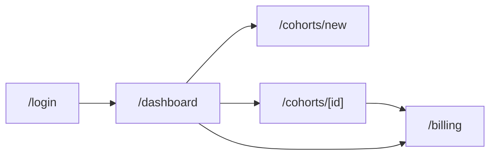

# 04 — Design

> **Criterion:** "Front-end designed in relation to back-end" — the UI should reflect the data model.

---

## Control Plane Pages



| Page | Purpose | Data Source |
|------|---------|-------------|
| `/login` | Cognito sign-in/sign-up | Cognito Hosted UI or Amplify |
| `/dashboard` | Cohort list + outcome cards | `Query PK=TENANT#, SK begins_with COHORT#` |
| `/cohorts/new` | Provisioning wizard | `PutItem COHORT#` |
| `/cohorts/[id]` | Cohort detail, outcomes, manage | `GetItem COHORT#`, `Query SUMMARY#` |
| `/billing` | Subscription state | `Query LICENSE#`, Stripe API |

---

## Page Specifications

### `/login` — Authentication

**Layout:**
```
┌─────────────────────────────────────────────────┐
│                                                 │
│              AgriNexus Platform                 │
│                                                 │
│  ┌─────────────────────────────────────────┐   │
│  │                                         │   │
│  │           [Cognito Hosted UI]           │   │
│  │                                         │   │
│  │    Email: ___________________           │   │
│  │    Password: ________________           │   │
│  │                                         │   │
│  │    [Sign In]     [Sign Up]              │   │
│  │                                         │   │
│  └─────────────────────────────────────────┘   │
│                                                 │
│  Demo credentials for judges:                   │
│  Email: demo@agrinexus.ai                       │
│  Password: [provided in submission]             │
│                                                 │
└─────────────────────────────────────────────────┘
```

**Behavior:**
- Cognito handles auth flow
- On success, redirect to `/dashboard`
- JWT stored in httpOnly cookie
- Tenant ID extracted from Cognito custom attribute

---

### `/dashboard` — Cohort List + Outcomes

**Layout:**
```
┌─────────────────────────────────────────────────────────────────┐
│  AgriNexus Platform                    [Partner Name]  [Logout] │
├─────────────────────────────────────────────────────────────────┤
│                                                                 │
│  Your Cohorts                              [+ New Cohort]       │
│                                                                 │
│  ┌─────────────────────┐  ┌─────────────────────┐              │
│  │ Latur District      │  │ Pune District       │              │
│  │ ────────────────────│  │ ────────────────────│              │
│  │ Status: ● Active    │  │ Status: ○ Draft     │              │
│  │                     │  │                     │              │
│  │ Follow-through      │  │ Follow-through      │              │
│  │ ████████░░ 78%      │  │ ░░░░░░░░░░ --       │              │
│  │                     │  │                     │              │
│  │ Nudges: 1,234 sent  │  │ Nudges: 0 sent      │              │
│  │ Farmers: 892        │  │ Farmers: 0          │              │
│  │                     │  │                     │              │
│  │ [View Details →]    │  │ [Activate →]        │              │
│  └─────────────────────┘  └─────────────────────┘              │
│                                                                 │
│  ┌─────────────────────┐                                       │
│  │ + Create Cohort     │                                       │
│  │                     │                                       │
│  │ Provision a new     │                                       │
│  │ district cohort     │                                       │
│  └─────────────────────┘                                       │
│                                                                 │
└─────────────────────────────────────────────────────────────────┘
```

**Data Flow:**
```typescript
// GET /api/cohorts
const cohorts = await docClient.send(new QueryCommand({
  TableName: TABLE_NAME,
  KeyConditionExpression: 'PK = :pk AND begins_with(SK, :sk)',
  ExpressionAttributeValues: {
    ':pk': `TENANT#${tenantId}`,
    ':sk': 'COHORT#',
  },
}));

// For each cohort, get latest summary
const summaries = await Promise.all(
  cohorts.Items.map(c => getSummary(tenantId, c.cohortId, currentPeriod()))
);
```

**Outcome Cards:**
- **Follow-through rate** is the hero metric (progress bar)
- Color coding: >70% green, 40-70% yellow, <40% red
- Draft cohorts show "Activate" CTA

---

### `/cohorts/new` — Provisioning Wizard

**Layout (Multi-step):**

```
Step 1: Location
┌─────────────────────────────────────────────────────────────────┐
│  New Cohort                                            Step 1/4 │
├─────────────────────────────────────────────────────────────────┤
│                                                                 │
│  District                                                       │
│  ┌─────────────────────────────────────────┐                   │
│  │ Pune                                  ▼ │ ← Searchable      │
│  └─────────────────────────────────────────┘                   │
│                                                                 │
│  📍 Coordinates will be set automatically                      │
│     Lat: 18.5204  Lon: 73.8567                                 │
│                                                                 │
│                                         [Next: Crops →]        │
└─────────────────────────────────────────────────────────────────┘

Step 2: Crops
┌─────────────────────────────────────────────────────────────────┐
│  New Cohort                                            Step 2/4 │
├─────────────────────────────────────────────────────────────────┤
│                                                                 │
│  Crops (select all that apply)                                  │
│                                                                 │
│  ☑ Cotton       ☑ Soybean                                      │
│  ☐ Wheat        ☐ Rice                                         │
│  ☐ Sugarcane    ☐ Groundnut                                    │
│                                                                 │
│  ℹ️ Knowledge base covers these crops for Indian districts     │
│                                                                 │
│                              [← Back]  [Next: Languages →]      │
└─────────────────────────────────────────────────────────────────┘

Step 3: Languages
┌─────────────────────────────────────────────────────────────────┐
│  New Cohort                                            Step 3/4 │
├─────────────────────────────────────────────────────────────────┤
│                                                                 │
│  Languages for advisory messages                                │
│                                                                 │
│  ☑ Hindi (hi)                                                  │
│  ☑ Marathi (mr)                                                │
│  ☐ Telugu (te)                                                 │
│  ☐ Kannada (kn)                                                │
│                                                                 │
│                              [← Back]  [Next: Review →]         │
└─────────────────────────────────────────────────────────────────┘

Step 4: Review
┌─────────────────────────────────────────────────────────────────┐
│  New Cohort                                            Step 4/4 │
├─────────────────────────────────────────────────────────────────┤
│                                                                 │
│  Review & Create                                                │
│                                                                 │
│  District:    Pune (18.5204, 73.8567)                          │
│  Crops:       Cotton, Soybean                                   │
│  Languages:   Hindi, Marathi                                    │
│  Nudge rules: Default (spray conditions)                        │
│                                                                 │
│  ┌─────────────────────────────────────────────────────────┐   │
│  │ ℹ️ Cohort will be created in DRAFT status.              │   │
│  │    Activate it to start receiving weather-triggered     │   │
│  │    nudges for farmers in this district.                 │   │
│  └─────────────────────────────────────────────────────────┘   │
│                                                                 │
│                              [← Back]  [Create Cohort]          │
└─────────────────────────────────────────────────────────────────┘
```

**API Call:**
```typescript
// POST /api/cohorts
{
  district: "Pune",
  lat: 18.5204,
  lon: 73.8567,
  crops: ["cotton", "soybean"],
  languages: ["hi", "mr"],
  nudgeRules: {
    sprayConditions: {
      maxWindSpeed: 15,
      maxHumidity: 85,
      minTemp: 15,
      maxTemp: 35
    },
    reminderIntervals: [24, 48, 72]
  }
}
// Response: { cohortId: "01H5ABC...", status: "draft" }
```

---

### `/cohorts/[id]` — Cohort Detail

**Layout:**
```
┌─────────────────────────────────────────────────────────────────┐
│  ← Back to Dashboard                                            │
├─────────────────────────────────────────────────────────────────┤
│                                                                 │
│  Pune District                              Status: ● Active    │
│  Created Jun 15, 2026 • Activated Jun 16, 2026                 │
│                                                                 │
├─────────────────────────────────────────────────────────────────┤
│  OUTCOMES (June 2026)                         [▼ Select Month] │
│                                                                 │
│  ┌────────────┐  ┌────────────┐  ┌────────────┐  ┌──────────┐ │
│  │ 78%        │  │ 1,234      │  │ 963        │  │ 892      │ │
│  │ Follow-    │  │ Nudges     │  │ Completed  │  │ Farmers  │ │
│  │ through    │  │ Sent       │  │            │  │          │ │
│  └────────────┘  └────────────┘  └────────────┘  └──────────┘ │
│                                                                 │
│  By Crop                                                        │
│  ┌──────────────────────────────────────────────────────────┐  │
│  │ Cotton     ████████████████░░░░ 82%    (687 / 838)       │  │
│  │ Soybean    ██████████████░░░░░░ 70%    (276 / 396)       │  │
│  └──────────────────────────────────────────────────────────┘  │
│                                                                 │
├─────────────────────────────────────────────────────────────────┤
│  CONFIGURATION                                                  │
│                                                                 │
│  District:    Pune (18.5204, 73.8567)                          │
│  Crops:       Cotton, Soybean                                   │
│  Languages:   Hindi, Marathi                                    │
│                                                                 │
│  Nudge Rules                                                    │
│  • Max wind: 15 km/h                                           │
│  • Humidity: <85%                                               │
│  • Temp: 15-35°C                                               │
│  • Reminders: +24h, +48h, +72h                                 │
│                                                                 │
├─────────────────────────────────────────────────────────────────┤
│  LICENSE                                                        │
│                                                                 │
│  Plan: Growth ($200/month)                                      │
│  Status: Active                                                 │
│  Next billing: Jul 16, 2026                                    │
│                                                                 │
│  [Manage Subscription]                                          │
│                                                                 │
└─────────────────────────────────────────────────────────────────┘
```

**For Draft Cohorts:**
```
├─────────────────────────────────────────────────────────────────┤
│  ACTIVATE THIS COHORT                                           │
│                                                                 │
│  This cohort is in draft mode. Farmers in Pune will not        │
│  receive weather-triggered nudges until you activate.           │
│                                                                 │
│  [Activate with Stripe]     [Demo Activate]                     │
│                              (Judges only)                      │
│                                                                 │
└─────────────────────────────────────────────────────────────────┘
```

---

### `/billing` — Subscription Management

**Layout:**
```
┌─────────────────────────────────────────────────────────────────┐
│  Billing                                                        │
├─────────────────────────────────────────────────────────────────┤
│                                                                 │
│  Current Plan: Growth                                           │
│  $200/month • Up to 3 districts, 10,000 farmers                │
│                                                                 │
│  Active Cohorts: 2 of 3                                        │
│                                                                 │
├─────────────────────────────────────────────────────────────────┤
│  INVOICES                                                       │
│                                                                 │
│  Jun 2026    $200.00    Paid    [View Invoice]                 │
│  May 2026    $200.00    Paid    [View Invoice]                 │
│                                                                 │
├─────────────────────────────────────────────────────────────────┤
│  PAYMENT METHOD                                                 │
│                                                                 │
│  Visa ending in 4242                                           │
│  Expires 12/2028                                               │
│                                                                 │
│  [Update Payment Method]  [Cancel Subscription]                 │
│                                                                 │
└─────────────────────────────────────────────────────────────────┘
```

---

## API Routes

### `GET /api/cohorts`

**Request:**
```
GET /api/cohorts
Authorization: Bearer <jwt>
```

**Response:**
```typescript
{
  cohorts: [
    {
      cohortId: "01H5ABC...",
      district: "Pune",
      status: "active",
      crops: ["cotton", "soybean"],
      createdAt: "2026-06-15T10:00:00Z",
      // Latest summary embedded
      outcomes: {
        period: "2026-06",
        followThroughRate: 0.78,
        nudgesSent: 1234,
        nudgesCompleted: 963
      }
    }
  ]
}
```

### `POST /api/cohorts`

**Request:**
```typescript
{
  district: "Pune",
  lat: 18.5204,
  lon: 73.8567,
  crops: ["cotton", "soybean"],
  languages: ["hi", "mr"],
  nudgeRules: { /* ... */ }
}
```

**Response:**
```typescript
{
  cohortId: "01H5ABC...",
  status: "draft"
}
```

### `GET /api/cohorts/[id]/outcomes`

**Request:**
```
GET /api/cohorts/01H5ABC.../outcomes?period=2026-06
Authorization: Bearer <jwt>
```

**Response:**
```typescript
{
  cohortId: "01H5ABC...",
  period: "2026-06",
  adviceSent: 2500,
  nudgesSent: 1234,
  nudgesCompleted: 963,
  followThroughRate: 0.78,
  byCrop: {
    cotton: {
      nudgesSent: 838,
      nudgesCompleted: 687,
      followThroughRate: 0.82
    },
    soybean: {
      nudgesSent: 396,
      nudgesCompleted: 276,
      followThroughRate: 0.70
    }
  }
}
```

### `POST /api/billing/checkout`

**Request:**
```typescript
{
  cohortId: "01H5ABC...",
  plan: "growth"
}
```

**Response:**
```typescript
{
  checkoutUrl: "https://checkout.stripe.com/..."
}
```

### `POST /api/webhooks/stripe`

**Incoming (from Stripe):**
```typescript
{
  type: "checkout.session.completed",
  data: {
    object: {
      id: "cs_...",
      subscription: "sub_...",
      metadata: {
        tenantId: "01H5XYZ...",
        cohortId: "01H5ABC..."
      }
    }
  }
}
```

**Actions:**
1. Verify webhook signature
2. Write `LICENSE#<cohortId>` to DynamoDB
3. Update `COHORT#<cohortId>` status to `active`
4. Set GSI2PK/GSI2SK for active cohort query

### `POST /api/cohorts/[id]/demo-activate`

**For judges only.** Bypasses Stripe.

**Request:**
```
POST /api/cohorts/01H5ABC.../demo-activate
Authorization: Bearer <jwt>
```

**Actions:**
1. Write `LICENSE#<cohortId>` with `isDemo: true`
2. Update cohort status to `active`
3. Return success

---

## UX Principles

### Data-Dense, Not Cluttered

- Show metrics at a glance (cards, not tables)
- Progress bars for rates (visual, scannable)
- Collapsible details for power users

### Mirror the Data Model

| UI Element | DynamoDB Entity |
|------------|-----------------|
| Cohort card | `COHORT#` item |
| Outcome metrics | `SUMMARY#` item |
| License status | `LICENSE#` item |
| Config panel | `COHORT#` attributes |

### Follow-Through as Hero Metric

The **follow-through rate** (nudges completed / nudges sent) is:
- Prominently displayed on every cohort card
- The primary progress bar
- The differentiator from competitors

### Progressive Disclosure

1. Dashboard: Overview cards
2. Cohort detail: Full metrics + config
3. Billing: Subscription management

---

## Responsive Design

**Breakpoints:**
- Mobile: < 640px (stack cards vertically)
- Tablet: 640-1024px (2-column grid)
- Desktop: > 1024px (3-column grid, sidebar)

**Mobile-first:** Partners may check dashboards on phones during field visits.
