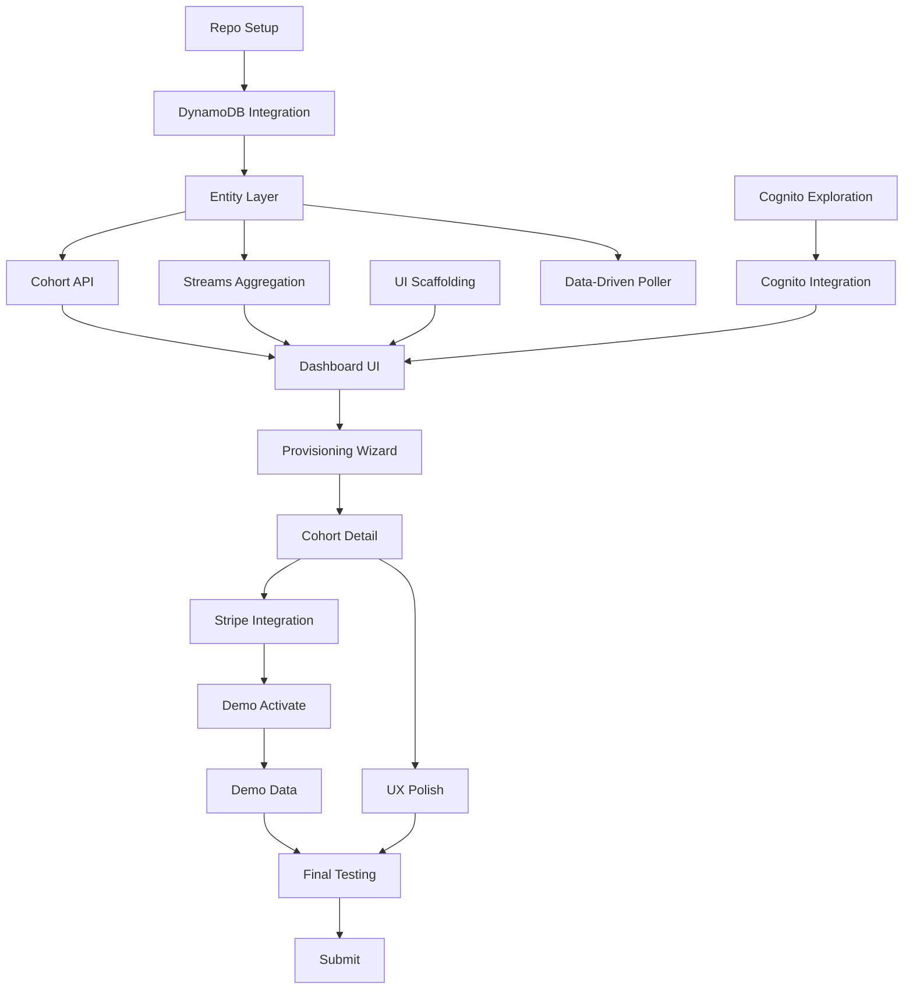

# 05 — Implementation Plan

> **Timeline:** Jun 20–29, 2026
> **Submission deadline:** Jun 30, 2026

---

## Tier Overview

| Tier | Scope | Priority |
|------|-------|----------|
| **Tier 1** | Multi-tenant model, provisioning, dashboard | Must ship |
| **Tier 2** | Streams aggregation, Stripe billing | Target |
| **Tier 3** | Custom campaigns, real-time ops | Stretch only |

---

## Phase 1: Foundation (Jun 20–21)

> **Energy level:** High
> **Goal:** De-risk the integration, prove the spine works

### Task 1.1: Repository Setup ✓
- [x] Create `agrinexus-platform` repo
- [x] Scaffold Next.js App Router + TypeScript
- [x] Configure Tailwind CSS
- [x] Deploy hello-world to Vercel

**Deliverable:** Live Vercel URL

### Task 1.2: DynamoDB Integration ✓
- [x] Install AWS SDK v3
- [x] Create `lib/dynamo.ts` with Document Client
- [x] Create `/api/healthcheck` endpoint
- [x] Verify write + read + delete cycle

**Deliverable:** Healthcheck returns `status: "healthy"`

### Task 1.3: Documentation
- [x] Create VALIDATION.md (existing engine analysis)
- [ ] Create docs/ folder with 7 spec documents

**Deliverable:** Complete documentation set

### Task 1.4: Multi-Tenant Entities
- [ ] Define TypeScript types for all entities
- [ ] Create `lib/entities/` with CRUD helpers
- [ ] Implement tenant-scoped query helpers

```typescript
// lib/entities/cohort.ts
export async function createCohort(
  tenantId: string,
  data: CohortInput
): Promise<Cohort>

export async function listCohorts(
  tenantId: string
): Promise<Cohort[]>

export async function getCohort(
  tenantId: string,
  cohortId: string
): Promise<Cohort | null>
```

**Deliverable:** Entity layer with TypeScript types

### Task 1.5: Cohort Provisioning API
- [ ] Implement `POST /api/cohorts`
- [ ] Implement `GET /api/cohorts`
- [ ] Implement `GET /api/cohorts/[id]`
- [ ] Add input validation (zod)

**Deliverable:** Cohorts can be created and retrieved via API

---

## Phase 2: Low-Energy Tasks (Jun 22–25)

> **Energy level:** Low (~1h/day)
> **Goal:** Non-code tasks, Cognito exploration

### Task 2.1: Asset Preparation
- [ ] Create new architecture diagram (three-plane)
- [ ] Take screenshots of existing WhatsApp demo
- [ ] Draft text description for submission
- [ ] Outline bonus article structure

**Deliverable:** Draft assets ready for polish

### Task 2.2: Cognito Exploration
- [ ] Create Cognito User Pool in AWS Console
- [ ] Configure app client
- [ ] Test hosted UI flow manually
- [ ] Document integration approach

**Deliverable:** Cognito pool ready, integration path clear

### Task 2.3: UI Scaffolding
- [ ] Create page stubs (`/login`, `/dashboard`, `/cohorts/new`, etc.)
- [ ] Set up basic layout component
- [ ] Add navigation between pages

**Deliverable:** Navigation shell working

---

## Phase 3: Core Build (Jun 27–28)

> **Energy level:** High (bulk of work)
> **Goal:** Complete Tier 1 + Tier 2

### Task 3.1: Cognito Integration
- [ ] Install `@aws-amplify/auth` or use Cognito SDK directly
- [ ] Implement `/login` page with Cognito Hosted UI
- [ ] Extract `tenantId` from JWT claims
- [ ] Create auth middleware for API routes
- [ ] Test tenant isolation (Partner A ≠ Partner B)

```typescript
// lib/auth.ts
export async function getAuthenticatedTenant(
  request: NextRequest
): Promise<{ tenantId: string; userId: string }>
```

**Deliverable:** Auth working, tenant isolation enforced

### Task 3.2: Dashboard UI
- [ ] Build cohort list component
- [ ] Fetch cohorts via `GET /api/cohorts`
- [ ] Display outcome cards with follow-through metrics
- [ ] Add "Create Cohort" button

**Deliverable:** Dashboard shows cohorts

### Task 3.3: Provisioning Wizard
- [ ] Build multi-step form component
- [ ] Step 1: District selection (with coordinates lookup)
- [ ] Step 2: Crop selection
- [ ] Step 3: Language selection
- [ ] Step 4: Review & create
- [ ] Submit via `POST /api/cohorts`
- [ ] Redirect to cohort detail on success

**Deliverable:** End-to-end provisioning flow

### Task 3.4: Cohort Detail Page
- [ ] Display cohort configuration
- [ ] Display outcome metrics (or placeholder if draft)
- [ ] Add "Activate" / "Demo Activate" buttons
- [ ] Show license status

**Deliverable:** Cohort detail page complete

### Task 3.5: Streams Aggregation (Tier 2)

> ⚠️ **Existing GSI2 Conflict:** Current GSI2 uses `NUDGE` PK. Platform needs `STATUS#active`. Either repurpose or add GSI3.

- [ ] Enable DynamoDB Streams (if not already)
- [ ] Create `SummaryAggregator` Lambda
- [ ] Deploy via SAM/CDK in platform stack
- [ ] Process nudge completion events
- [ ] Update `SUMMARY#` items with atomic counters
- [ ] Test with simulated events

```yaml
# template.yaml addition
SummaryAggregator:
  Type: AWS::Serverless::Function
  Properties:
    Handler: aggregator.handler
    Events:
      DynamoDBStream:
        Type: DynamoDB
        Properties:
          Stream: !GetAtt AgriNexusTable.StreamArn
          StartingPosition: TRIM_HORIZON
          FilterCriteria:
            Filters:
              - Pattern: '{"eventName":["MODIFY"]}'
```

**Deliverable:** Summaries update automatically on nudge completion

### Task 3.6: Data-Driven WeatherPoller (Tier 2)

> ⚠️ **Production Isolation:** Deploy modified WeatherPoller in platform stack only; production continues using hardcoded version.

- [ ] Fork `src/weather/handler.py` to platform stack
- [ ] Replace `DISTRICT_COORDS` with GSI2 query
- [ ] Add `COHORT_MODE` env var for safety toggle
- [ ] Add GSI2PK/GSI2SK to active cohorts
- [ ] Test weather polling for platform-provisioned cohort

```python
# Platform version
def get_active_cohort_districts():
    if os.environ.get('COHORT_MODE') == 'static':
        return DISTRICT_COORDS  # Fallback

    response = table.query(
        IndexName='GSI2',
        KeyConditionExpression='GSI2PK = :pk',
        ExpressionAttributeValues={':pk': 'STATUS#active'}
    )
    return [
        {'district': item['district'], 'lat': item['lat'], 'lon': item['lon']}
        for item in response.get('Items', [])
    ]
```

**Deliverable:** WeatherPoller reads active cohorts from DynamoDB

### Task 3.7: Stripe Integration (Tier 2)
- [ ] Create Stripe account (test mode)
- [ ] Define subscription products/prices
- [ ] Implement `POST /api/billing/checkout`
- [ ] Implement `POST /api/webhooks/stripe`
- [ ] On webhook: write `LICENSE#`, update cohort status
- [ ] Test end-to-end checkout flow

**Deliverable:** Stripe checkout activates cohort

### Task 3.8: Demo Activate Path
- [ ] Implement `POST /api/cohorts/[id]/demo-activate`
- [ ] Write `LICENSE#` with `isDemo: true`
- [ ] Bypass Stripe for judges
- [ ] Add "Demo Activate" button to UI

**Deliverable:** Judges can activate without payment

---

## Phase 4: Polish & Submit (Jun 29)

> **Goal:** Package everything for submission

### Task 4.1: UX Polish
- [ ] Responsive design check
- [ ] Loading states
- [ ] Error handling
- [ ] Empty states

### Task 4.2: Pre-Seed Demo Data
- [ ] Create demo tenant
- [ ] Create sample cohort with realistic metrics
- [ ] Ensure demo credentials work

### Task 4.3: Final Testing
- [ ] Run all test scenarios (see 06-testing.md)
- [ ] Verify judge access flow
- [ ] Check dashboard load time (<2s)

### Task 4.4: Submission Artifacts
- [ ] Finalize text description
- [ ] Record demo video (<3 min)
- [ ] Export architecture diagram
- [ ] Capture AWS screenshots
- [ ] Write bonus article
- [ ] Verify README award line

### Task 4.5: Submit
- [ ] Publish Vercel project
- [ ] Capture Vercel Team ID
- [ ] Submit on Devpost

---

## Task Dependencies



---

## Risk Mitigation

| Risk | Mitigation |
|------|------------|
| Cognito eats weekend | Fall back to NextAuth; timebox Cognito to 4h |
| Streams complexity | Skip if time-tight; use read-time aggregation |
| WeatherPoller changes break prod | Deploy in separate stack; use feature flag |
| Stripe webhook issues | Demo-activate path always works; Stripe is nice-to-have |
| GSI2 conflict | Add GSI3 if repurposing is risky |

---

## Definition of Done (per task)

- [ ] Code written and working locally
- [ ] Deployed to Vercel (frontend) or AWS (Lambda)
- [ ] Manual test passed
- [ ] No TypeScript errors
- [ ] Committed to git with descriptive message

---

## Checkpoint: End of Jun 28

**Tier 1 must be complete:**
- [ ] Multi-tenant model working
- [ ] Cohort provisioning end-to-end
- [ ] Dashboard showing cohorts
- [ ] Tenant isolation verified

**Tier 2 target:**
- [ ] Streams aggregation updating summaries
- [ ] Stripe checkout activating cohorts
- [ ] WeatherPoller reading from DynamoDB (or feature-flagged)
