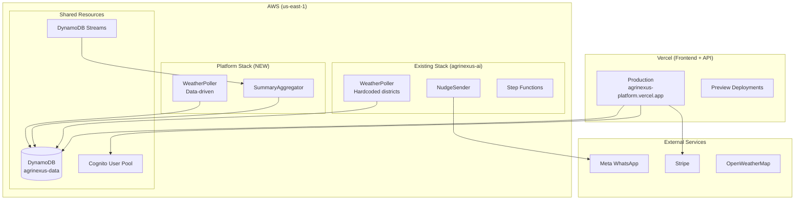

# 07 — Deployment

> **Goal:** Vercel frontend + AWS backend, with clear evidence for H0 judges.

---

## Architecture Deployment View



---

## Vercel Deployment

### Step 1: Project Setup

```bash
# Install Vercel CLI
npm i -g vercel

# Link to Vercel (first time)
cd agrinexus-platform
vercel link
```

### Step 2: Environment Variables

Configure in Vercel Dashboard → Settings → Environment Variables:

| Variable | Value | Environments |
|----------|-------|--------------|
| `AWS_REGION` | `us-east-1` | All |
| `AWS_ACCESS_KEY_ID` | `(IAM key)` | All |
| `AWS_SECRET_ACCESS_KEY` | `(IAM secret)` | All |
| `DYNAMODB_TABLE_NAME` | `agrinexus-data` | All |
| `COGNITO_USER_POOL_ID` | `us-east-1_xxxxx` | All |
| `COGNITO_CLIENT_ID` | `(app client ID)` | All |
| `STRIPE_SECRET_KEY` | `sk_test_...` | All |
| `STRIPE_WEBHOOK_SECRET` | `whsec_...` | All |
| `STRIPE_PUBLISHABLE_KEY` | `pk_test_...` | All |
| `NEXT_PUBLIC_COGNITO_DOMAIN` | `(hosted UI domain)` | All |

### Step 3: Deploy

```bash
# Deploy to preview
vercel

# Deploy to production
vercel --prod
```

### Step 4: Capture Deployment Info

For submission:
- **Project URL:** `https://agrinexus-platform.vercel.app`
- **Team ID:** Found in Vercel Dashboard → Team Settings

---

## AWS Deployment

### DynamoDB (Shared Table)

The platform uses the existing `agrinexus-data` table. New entity types (`TENANT#`, `COHORT#`, etc.) coexist with existing ones.

**If GSI2 needs modification:**

```bash
# Check current GSI2 schema
aws dynamodb describe-table --table-name agrinexus-data --query 'Table.GlobalSecondaryIndexes'

# If GSI2 doesn't exist or needs recreation
aws dynamodb update-table \
  --table-name agrinexus-data \
  --attribute-definitions \
    AttributeName=GSI2PK,AttributeType=S \
    AttributeName=GSI2SK,AttributeType=S \
  --global-secondary-index-updates \
    "[{\"Create\":{\"IndexName\":\"GSI2\",\"KeySchema\":[{\"AttributeName\":\"GSI2PK\",\"KeyType\":\"HASH\"},{\"AttributeName\":\"GSI2SK\",\"KeyType\":\"RANGE\"}],\"Projection\":{\"ProjectionType\":\"ALL\"}}}]"
```

### DynamoDB Streams

Enable if not already:

```bash
aws dynamodb update-table \
  --table-name agrinexus-data \
  --stream-specification StreamEnabled=true,StreamViewType=NEW_AND_OLD_IMAGES
```

### Cognito User Pool

**Create via AWS Console or CLI:**

```bash
aws cognito-idp create-user-pool \
  --pool-name agrinexus-platform-partners \
  --auto-verified-attributes email \
  --username-attributes email \
  --schema Name=tenantId,AttributeDataType=String,Mutable=true
```

**Create App Client:**

```bash
aws cognito-idp create-user-pool-client \
  --user-pool-id us-east-1_xxxxx \
  --client-name agrinexus-platform-web \
  --generate-secret false \
  --supported-identity-providers COGNITO \
  --callback-urls https://agrinexus-platform.vercel.app/api/auth/callback \
  --logout-urls https://agrinexus-platform.vercel.app \
  --allowed-o-auth-flows code \
  --allowed-o-auth-scopes openid email profile
```

**Configure Hosted UI Domain:**

```bash
aws cognito-idp create-user-pool-domain \
  --user-pool-id us-east-1_xxxxx \
  --domain agrinexus-platform
```

### SummaryAggregator Lambda (Platform Stack)

**template.yaml (platform additions):**

```yaml
AWSTemplateFormatVersion: '2010-09-09'
Transform: AWS::Serverless-2016-10-31
Description: AgriNexus Platform - B2B Control Plane

Parameters:
  TableName:
    Type: String
    Default: agrinexus-data

Resources:
  SummaryAggregator:
    Type: AWS::Serverless::Function
    Properties:
      FunctionName: agrinexus-platform-aggregator
      Runtime: python3.11
      Handler: aggregator.handler
      CodeUri: src/aggregator/
      Timeout: 30
      MemorySize: 256
      Environment:
        Variables:
          TABLE_NAME: !Ref TableName
      Policies:
        - DynamoDBCrudPolicy:
            TableName: !Ref TableName
      Events:
        DynamoDBStream:
          Type: DynamoDB
          Properties:
            Stream: !Sub arn:aws:dynamodb:${AWS::Region}:${AWS::AccountId}:table/${TableName}/stream/*
            StartingPosition: TRIM_HORIZON
            BatchSize: 100
            FilterCriteria:
              Filters:
                - Pattern: '{"eventName":["MODIFY"]}'

  # Optional: Platform WeatherPoller (data-driven)
  PlatformWeatherPoller:
    Type: AWS::Serverless::Function
    Properties:
      FunctionName: agrinexus-platform-weather-poller
      Runtime: python3.11
      Handler: weather.handler
      CodeUri: src/weather/
      Timeout: 60
      MemorySize: 256
      Environment:
        Variables:
          TABLE_NAME: !Ref TableName
          COHORT_MODE: dynamic  # Key difference from existing
          STATE_MACHINE_ARN: !Ref NudgeStateMachine
      Policies:
        - DynamoDBReadPolicy:
            TableName: !Ref TableName
        - Statement:
            Effect: Allow
            Action: states:StartExecution
            Resource: !Ref NudgeStateMachine
      Events:
        Schedule:
          Type: Schedule
          Properties:
            Schedule: rate(6 hours)
```

**Deploy:**

```bash
cd agrinexus-platform/infra
sam build
sam deploy --guided
```

---

## IAM Configuration

### Vercel IAM User

Create a dedicated IAM user for Vercel with least-privilege access:

**Policy:**

```json
{
  "Version": "2012-10-17",
  "Statement": [
    {
      "Sid": "DynamoDBAccess",
      "Effect": "Allow",
      "Action": [
        "dynamodb:GetItem",
        "dynamodb:PutItem",
        "dynamodb:UpdateItem",
        "dynamodb:DeleteItem",
        "dynamodb:Query"
      ],
      "Resource": [
        "arn:aws:dynamodb:us-east-1:ACCOUNT_ID:table/agrinexus-data",
        "arn:aws:dynamodb:us-east-1:ACCOUNT_ID:table/agrinexus-data/index/*"
      ]
    }
  ]
}
```

**Create user:**

```bash
aws iam create-user --user-name vercel-agrinexus-platform

aws iam put-user-policy \
  --user-name vercel-agrinexus-platform \
  --policy-name DynamoDBAccess \
  --policy-document file://vercel-policy.json

aws iam create-access-key --user-name vercel-agrinexus-platform
# Save the AccessKeyId and SecretAccessKey for Vercel env vars
```

---

## Stripe Configuration

### Test Mode Setup

1. Create Stripe account at [stripe.com](https://stripe.com)
2. Stay in **Test Mode** (toggle in dashboard)
3. Create Products:

```bash
# Create subscription products
stripe products create --name "Starter Plan" --description "1 district, 1000 farmers"
stripe products create --name "Growth Plan" --description "3 districts, 10000 farmers"

# Create prices
stripe prices create \
  --product prod_starter \
  --unit-amount 5000 \
  --currency usd \
  --recurring '{"interval":"month"}'

stripe prices create \
  --product prod_growth \
  --unit-amount 20000 \
  --currency usd \
  --recurring '{"interval":"month"}'
```

### Webhook Configuration

1. Go to Stripe Dashboard → Developers → Webhooks
2. Add endpoint: `https://agrinexus-platform.vercel.app/api/webhooks/stripe`
3. Select events: `checkout.session.completed`
4. Copy signing secret → Vercel env var `STRIPE_WEBHOOK_SECRET`

---

## Screenshots for Submission

Capture these for H0 evidence:

### 1. DynamoDB Table

```
AWS Console → DynamoDB → Tables → agrinexus-data
```

Screenshot showing:
- Table overview
- Item count
- GSIs (GSI1, GSI2)
- Streams enabled

### 2. DynamoDB Streams

```
AWS Console → DynamoDB → Tables → agrinexus-data → Exports and streams
```

Screenshot showing:
- Stream enabled
- Stream ARN

### 3. Cognito User Pool

```
AWS Console → Cognito → User Pools → agrinexus-platform-partners
```

Screenshot showing:
- User pool overview
- App clients
- Hosted UI domain

### 4. Lambda Functions (Platform Stack)

```
AWS Console → Lambda → Functions
```

Screenshot showing:
- SummaryAggregator function
- PlatformWeatherPoller (if deployed)

### 5. Vercel Project

```
Vercel Dashboard → agrinexus-platform
```

Screenshot showing:
- Project overview
- Environment variables (names only, not values)
- Recent deployments

### 6. Live Dashboard

```
https://agrinexus-platform.vercel.app/dashboard
```

Screenshot showing:
- Cohort cards
- Follow-through metrics
- Active status indicators

### 7. Stripe Dashboard

```
Stripe Dashboard → Test Mode → Products
```

Screenshot showing:
- Subscription products
- Pricing tiers
- Test mode indicator

---

## Deployment Checklist

### Pre-Deployment

- [ ] All tests passing locally
- [ ] Environment variables documented
- [ ] IAM user created with correct policy
- [ ] Stripe products created in test mode

### Vercel

- [ ] Project linked to Vercel
- [ ] All environment variables set
- [ ] Production deployment successful
- [ ] Healthcheck endpoint returns healthy

### AWS

- [ ] DynamoDB GSIs configured
- [ ] Streams enabled
- [ ] SummaryAggregator deployed
- [ ] Cognito User Pool created
- [ ] App client configured
- [ ] Hosted UI domain set up

### Stripe

- [ ] Webhook endpoint configured
- [ ] Signing secret added to Vercel
- [ ] Test checkout flow works

### Verification

- [ ] Login flow works
- [ ] Cohort provisioning works
- [ ] Dashboard loads <2s
- [ ] Demo credentials work
- [ ] Demo activate works

### Evidence Captured

- [ ] DynamoDB table screenshot
- [ ] DynamoDB Streams screenshot
- [ ] Cognito screenshot
- [ ] Vercel project screenshot
- [ ] Live dashboard screenshot
- [ ] Stripe dashboard screenshot
- [ ] Team ID noted for submission

---

## Production Isolation

> ⚠️ **Critical:** The existing AIdeas demo must continue working.

### What Stays Unchanged

| Component | Stack | Status |
|-----------|-------|--------|
| Existing WeatherPoller | agrinexus-ai | Hardcoded districts |
| Existing NudgeSender | agrinexus-ai | Unchanged |
| Existing Step Functions | agrinexus-ai | Unchanged |
| WhatsApp webhooks | agrinexus-ai | Unchanged |

### What's New (Platform Stack)

| Component | Stack | Notes |
|-----------|-------|-------|
| SummaryAggregator | agrinexus-platform | Processes Streams |
| PlatformWeatherPoller | agrinexus-platform | Data-driven (optional) |
| Vercel frontend | N/A | Separate deployment |

### Shared Resources

| Resource | Access |
|----------|--------|
| DynamoDB table | Both stacks read/write |
| DynamoDB Streams | Platform stack consumes |

### Rollback Plan

If platform deployment causes issues:

1. Disable SummaryAggregator Lambda trigger
2. Delete platform-created items (PK prefix `TENANT#`)
3. Existing delivery engine continues unaffected
