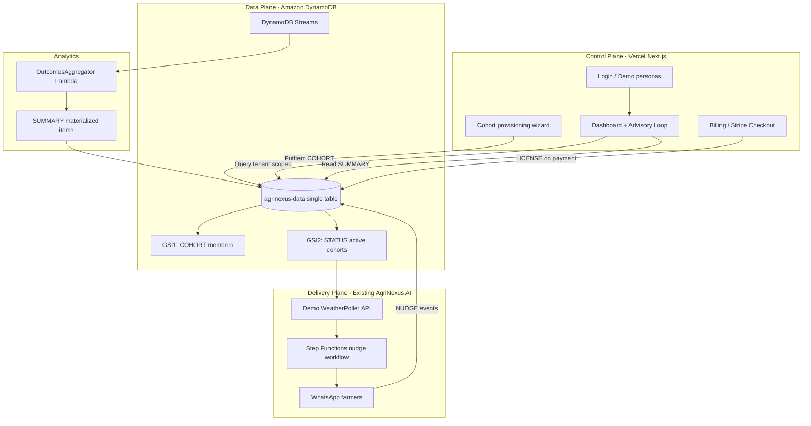

# H0 Architecture Diagram

Three planes, one DynamoDB table.

## Entity keys

| Entity | PK | SK |
|--------|----|----|
| Tenant | TENANT#id | META |
| Cohort | TENANT#id | COHORT#id |
| License | TENANT#id | LICENSE#cohortId |
| Summary | TENANT#id | SUMMARY#cohortId#period |
| Membership | PHONE#phone | MEMBERSHIP |

## Vercel deployment

- Project: agrinexus-platform
- Team ID: see `.vercel/project.json` → `orgId`

## AWS proof screenshots

> ⚠️ **`agrinexus-data` will NOT appear under Vercel → Storage.** We connect via the AWS SDK with
> a scoped IAM key, not the Vercel-provisioned integration, so the judges' default verification
> path (Vercel dashboard → Storage) shows nothing. Proof must come from the explicit
> console + env-var walkthrough below and in the demo video (FAQ-sanctioned escape hatch).

Capture for submission:

1. DynamoDB table items (TENANT#, COHORT#, SUMMARY#)
2. DynamoDB Streams enabled
3. OutcomesAggregator Lambda
4. Vercel env vars (AWS_REGION, DYNAMODB_TABLE_NAME) — proves the deployed app's connection
5. Stripe test dashboard with branded checkout
